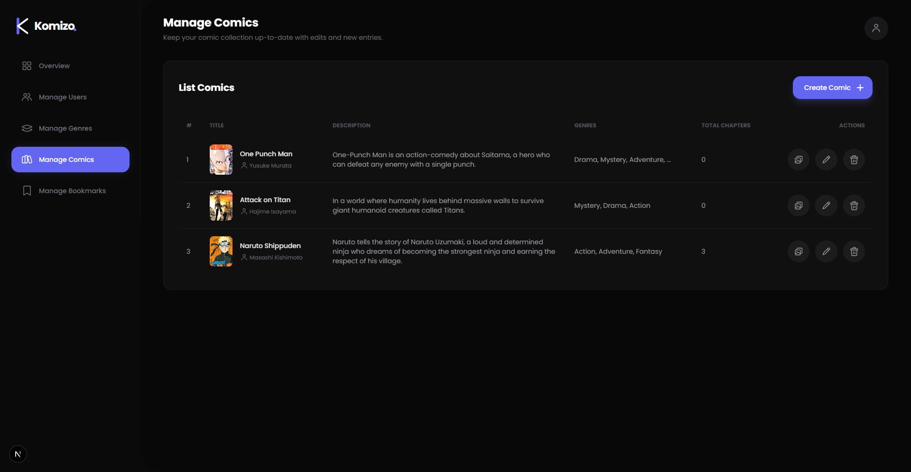
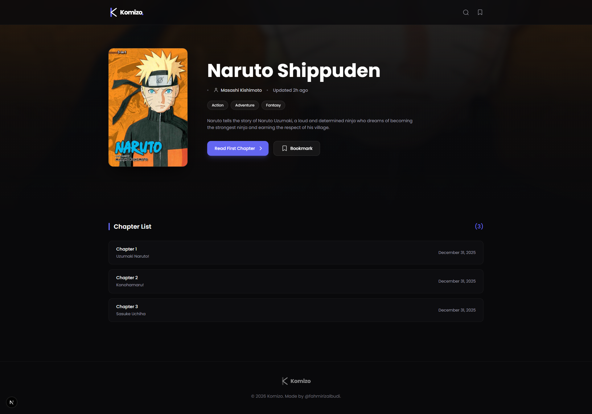

<div align="center">
<a href="https://github.com/fahmirizalbudi/komizo" target="blank">

</a>
<br/>

<br />
<br />


</div>

<br />

## 📔 Komizo

Komizo is a web application for reading comics online with a fast, modern and responsive interface. Built with Next.js, TypeScript, and PostgreSQL to ensure high performance and data reliability. Key features include:

## 🖼️ Preview


<br />

<br />


## ✨ Features

- **📳 Seamless Reading:** Optimized comic viewer with smooth navigation between chapters.
- **🛡️ User Management:** administrative control to view and manage registered users.
- **📚 Comic Management:** Full CRUD (Create, Read, Update, Delete) system for comic titles, including cover uploads and metadata.
- **📑 Chapter Management:** Organize comic chapters, upload pages, and manage release order efficiently.
- **🏷️ Genre Management:** Create and assign genres to organize the comic library structure.
- **⚡ High Performance:** Powered by Next.js for server-side rendering and fast page loads.
- **📱 Responsive Design:** Modern UI/UX that looks great on desktop and mobile devices.
- **🛡️ Type Safe:** Built with TypeScript for robust and maintainable code.
- **🗄️ Reliable Data:** Uses PostgreSQL for secure and structured data management.

## 👩‍💻 Tech Stack

- **Next.js**: The React Framework for the Web.
- **TypeScript**: A strongly typed programming language that builds on JavaScript.
- **PostgreSQL**: The world's most advanced open source relational database.

## 📦 Getting Started

To get a local copy of this project up and running, follow these steps.

### 🚀 Prerequisites

- **Node.js** & **NPM**.
- **PostgreSQL** database installed and running.

## 🛠️ Installation

1. **Clone the repository:**

   ```bash
   git clone https://github.com/fahmirizalbudi/komizo.git
   cd komizo
   ```

2. **Install dependencies:**

   ```bash
   npm install
   ```

3. **Start the development server:**

   ```bash
   npm run dev
   ```

## 📖 Usage

### ✔ Running the Application

- **Development mode:** `npm run dev`.
- **Production mode:** `npm run build`.

> Open [http://localhost:3000](http://localhost:3000) to view it in the browser.

## 📜 License

All rights reserved. This project is for educational purposes only and cannot be used or distributed without permission.
