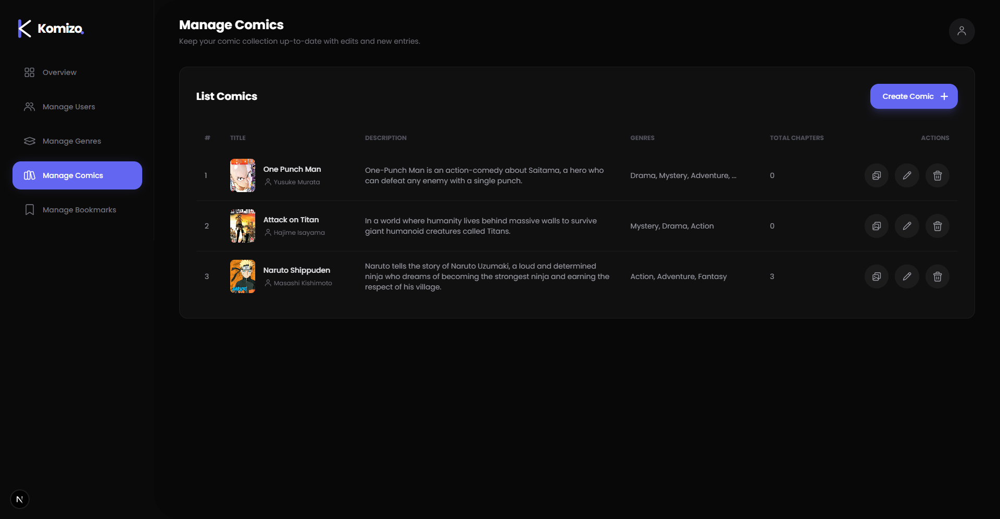
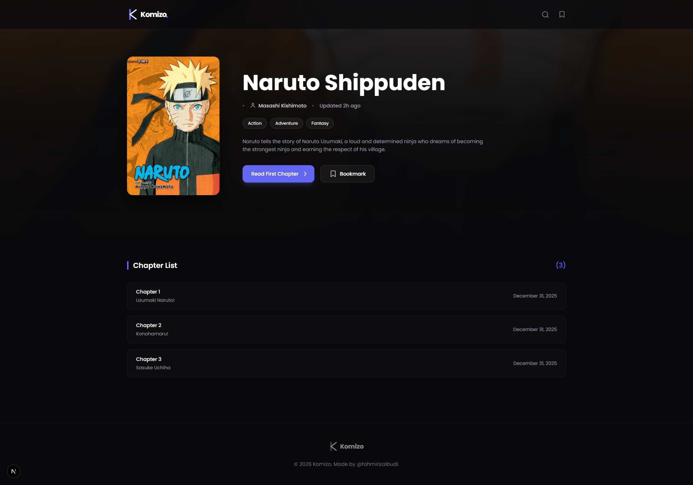

<div align="center">
<a href="https://github.com/fahmirizalbudi/komizo" target="blank">

</a>
<br/>

<br />
<br />


</div>

<br />

## Komizo

Komizo is a high-performance web application for online comic consumption, featuring a modern and responsive interface. Developed with Next.js, TypeScript, and PostgreSQL, the platform ensures technical reliability and a seamless user experience.

## Preview


<br />

<br />


## Features

- **Optimized Reader:** A streamlined comic viewer with efficient chapter navigation.
- **User Management:** Administrative interface for overseeing registered user accounts.
- **Comic Administration:** Comprehensive CRUD system for comic metadata and cover assets.
- **Chapter Management:** Structured system for managing chapters, page uploads, and release sequencing.
- **Taxonomy Management:** Flexible genre system to maintain library organization.
- **High Performance:** Server-side rendering via Next.js for rapid page delivery.
- **Responsive Architecture:** Adaptable UI/UX optimized for both desktop and mobile environments.
- **Type Safety:** Robust codebase maintained through strict TypeScript implementation.
- **Data Integrity:** Secure and structured data persistence using PostgreSQL.

## Tech Stack

- **Next.js**: The React framework for production-grade web applications.
- **TypeScript**: A strongly typed programming language that builds on JavaScript.
- **PostgreSQL**: Advanced open-source relational database system.

## Getting Started

Follow these instructions to set up a local development environment.

### Prerequisites

- **Node.js** and **NPM**.
- **PostgreSQL** database instance.

## Installation

1. **Clone the repository:**

   ```bash
   git clone https://github.com/fahmirizalbudi/komizo.git
   cd komizo
   ```

2. **Install dependencies:**

   ```bash
   npm install
   ```

3. **Configure Environment Variables:**

   Create a `.env` file in the root directory and configure your PostgreSQL connection strings and other necessary environment variables.

4. **Start the development server:**

   ```bash
   npm run dev
   ```

## Usage

### Execution Commands

- **Development:** `npm run dev`
- **Build:** `npm run build`
- **Production:** `npm start`

The application will be accessible at [http://localhost:3000](http://localhost:3000).

## License

All rights reserved. This project is intended for educational purposes only and may not be distributed or utilized commercially without explicit permission.
